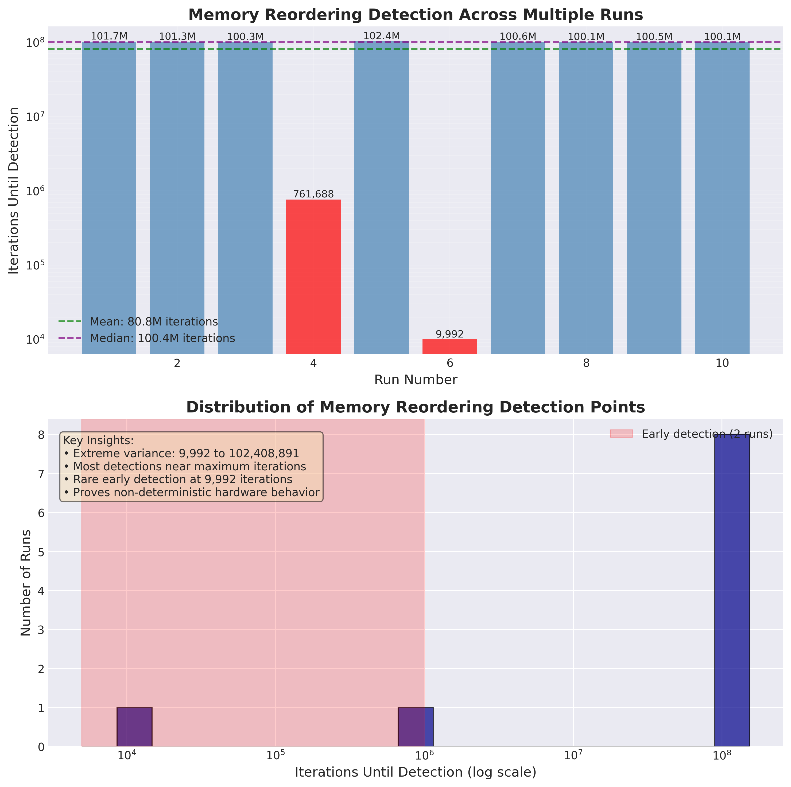

# Lock-Free Queue Benchmark

[](https://github.com/shreyaganesh0/lockfree-queue/actions/workflows/benchmark.yml)

## Description
Production grade lock-free queue implementation acheiving 50M ops/second. designed for high frequesncy operations where microsecond latency matters.

## Experiments

## Project Structure
- all experiments live in  experiments/{experiment_name}
- scripts for building testing and visualization live in scripts
- source code lives in src

## Experiment 1 - Cache Line Bouncing (false_sharing)

### Part A - Shared V/S Seperate Cache Lines

    Two threads incrementing seperate variables can be upto 15x slower than one thread doing both
    this experiment demonstrates why understanding CPU cache coherence is ciritical for production
    systems serving millions of users.

### Part B - Odd Cache Timing 

    Even after adding only 1 byte of padding between the two counters the same speed up is still witnessed, 
    despite being on the same cache line.lI tried to investigate this further

    I first tried to print out the distance between the actual counters in memory to check if the reason
    was due to some compiler optimization.

## Usage
- Basic Build
```
scripts/build.sh

bin/false_sharing bad

bin/false_sharing good

# the cross and same ccx tests only apply to multi CCX architectures
# read your CPU architecture details to see if this applies

bin/false_sharing good cross-ccx 

bin/false_sharing good same-ccx 
```
- 

## Experiment 2 - CPU Instruction and Memory Reordering Experiment (memory_ordering)

## Hypothesis

    This experiment aims to implement Dekkers algorithmn to prove that memory reordering 
    of instructions may cause deadlocks that are subtle and hard to reproduce
    Hardware Specifications - Ryzen 9 7940HS single 8-core CCX

## Results
    Memory Reordering Detection Statistics
    ========================================
    Runs analyzed: 10
    Minimum iterations: 9,992 (0.01M)
    Maximum iterations: 102,408,891 (102.41M)
    Mean iterations: 80,790,652 (80.79M)
    Median iterations: 100,409,264 (100.41M)
    Standard deviation: 40,208,990 (40.21M)
    Coefficient of variation: 49.8%




## Usage
- Basic Build
```
scripts/build.sh
bin/memory_ordering
```
- Run Stress Test Script
```
scripts/stress_memory_ordering.sh
```

  - Optional Core Switching
    ```
    bin/memory_reordering min #core (0,1)
    bin/memory_reordering max #core (0,7)
    ```
    - View Results
    ```
    scripts/visualize_stress_test.py
    ```
## Experiment 3 - Hazard Pointers Visualization
Hazard pointers are a way to make algorithms that are garunteed to be lock free safe in Garbage 
Collected languages  to be lock free safe in Memory managed languages.

Each object keeps track of a hazard pointer list
    This list is like a flag showing that it is currently utilising the resource

This way if another thread tries to delete the resource it checks the nodes hazard pointer to see
if any other thread is using it before freeing the node.

This prevents use after free bugs that can occur without a lock.

### Usage
- Build the script
```
scripts/tool_build.sh
```
- Run the visualization
```
bin/hazard_pointers_viz
```

This will run a visualization on 4 nodes with 3 threads reading from the nodes
and 1 thread trying to delete nodes if not blocked by the hazard pointer
